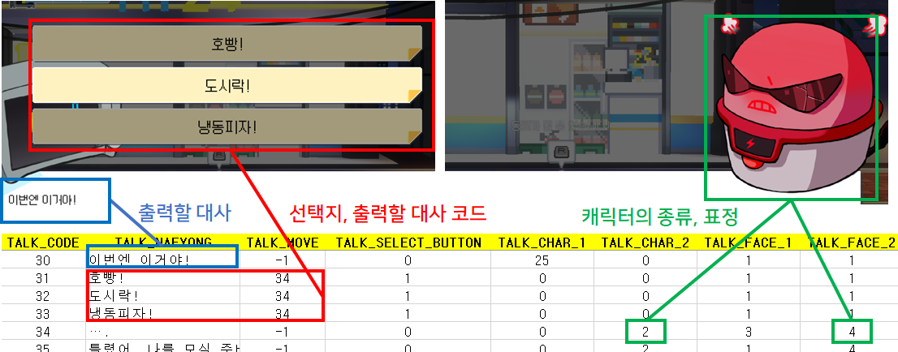

## 프로젝트 개요

#### 플랫폼
- PC (Windows)

#### 장르
- 플랫포머

#### 개발 환경
- Unity Engine

## 담당 업무
- 소심한 디렉팅
    - 팀 내부 일정 관리
    - 기능 기획서, 레벨 디자인, 대화 스크립트의 방향성 제시를 위한 초안 작성 후 피드백
- 플레이어 및 동료 시스템 구현
- 몬스터 구현
- 스킬 시스템 구현
- 대화 시스템 구현
- UI 구현
- 시네머신을 통한 카메라 구현

## 작업 문서

## 기본 엔티티 구현
  
이동, 달걀발사(공격), 스킬(대시) 등 플레이어 전반을 구현하였습니다.  
이동속도와 대시 쿨타임 등, 세부 수치는 엔진 내 인스펙터에서 수정할 수 있습니다.  

  
플레이어를 따라다니면서 전력을 교체할 수 있으며,  
각자 개별적인 스킬을 가지고 있는 동료(총 4개)를 구현하였습니다.  

스킬 쿨타임, 효력, 지속시간 등의 수치는 엔진 내 인스펙터에서 수정할 수 있습니다.

  
시민, 술취한 시민, 점장 등 플레이어의 진행을 방해하는 몬스터를 구현했습니다.  
이동속도, 포착 거리 수치는 엔진 내 인스펙터에서 수정할 수 있습니다.  

## 스킬 시스템
  

플레이어, 동료, 시민, 점장이 사용하는 스킬의 쿨타임 등을 제어하기 위한 SkillManager를 구현하였습니다.  
스킬을 사용하는 모든 캐릭터들은 SkillManager를 거치고 있습니다.  

## 대화 시스템
  
미리 작성된 CSV파일을 읽어와 해당하는 대사 스크립트, 선택지 버튼과 캐릭터 일러스트를 출력합니다.  
대화 정보가 담긴 CSV파일 양식을 제작하였습니다.  

## UI
  
조작법, 사진, 대화창 등의 인게임 UI를 구현하였습니다.  
대화창의 경우, csv파일로 저장된 대화 내용을 불러와 출력합니다.  
사진의 경우, 저장된 문구들을 등장 시마다 랜덤으로 출력합니다.  

